
姓名：尹传林 学号：24110041036

| 姓名和学号？ | 尹传林，24110041036 |
| --- | --- |
| 本实验属于哪门课程？ | 中国海洋大学25秋《软件工程原理与实践》 |
| 实验名称？ | 实验2：深度学习基础 |
| 博客链接： | https://github.com/Yin-C-L/SE_Lab2 |

## 一、实验内容

### 第一部分：代码练习

#### 3.1 PyTorch 基础练习

本部分练习 PyTorch 的基础操作，主要包括：Tensor（张量）的定义、常见创建方法，以及 Tensor 上的基本运算、布尔运算和线性运算。

（1）定义数据：Tensor 是 PyTorch 中数字各种形式的总称，可以表示标量、向量、矩阵以及更高维的张量。

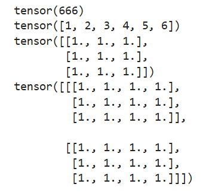

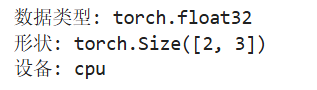

解读：上图中分别创建了标量（666）、一维向量（1~6）、3×3 全 1 矩阵和 2×3×4 的三维张量。Tensor 支持多种数据类型（torch.float32、torch.int64 等），本机没有 GPU，所以 device 显示为 cpu。

（2）创建 Tensor 的常用方法：ones、zeros、eye、arange、linspace、rand、randn、normal、uniform、randperm 等。

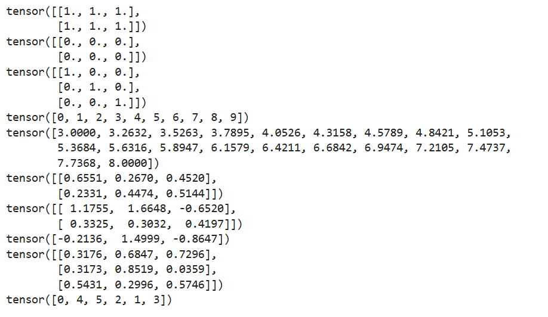

解读：ones/zeros 生成全 1/全 0 张量，eye 生成单位矩阵，arange/linspace 生成等差/等间隔序列，rand 生成 [0,1) 均匀分布随机数，randn 生成标准正态分布随机数，normal/uniform 可指定分布参数，randperm 生成随机排列。

（3）Tensor 的操作：基本运算（加减乘除、幂、取余、三角函数、取整）、布尔运算（比较、最大最小、排序）、线性运算（矩阵乘法、转置、迹、点积、逆、奇异值分解）。

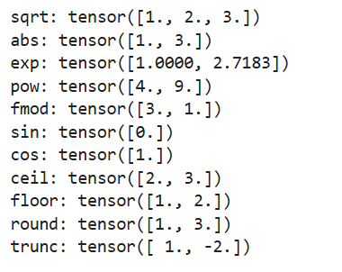

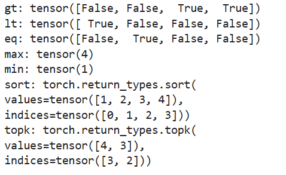

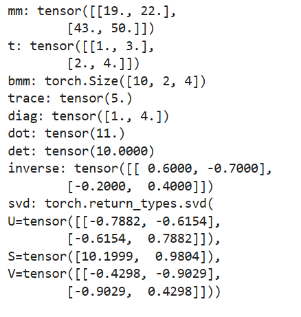

解读：基本运算包括 sqrt、abs、exp、pow、fmod 以及三角函数和 ceil/floor/round/trunc 等取整运算；布尔运算返回布尔型张量，max/min 求最值，sort/topk 返回值和索引；线性运算中 mm 做矩阵乘法、bmm 做批量矩阵乘法、t 转置、dot 点积、trace 迹、diag 对角线、det 行列式、inverse 求逆、svd 奇异值分解。

#### 3.2 螺旋数据分类

本部分用神经网络实现对三类螺旋分布数据的分类。数据共 3 类（C=3），每类 1000 个样本（N=1000），每个样本 2 维特征（D=2），隐层单元数 H=100。运行设备为 CPU。

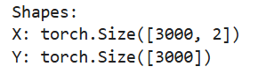

解读：X 是 3000×2 的特征矩阵（3000 个样本、每个 2 维坐标），Y 是长度为 3000 的标签向量，取值为 0/1/2。三类样本的角度区间相互交错并加入噪声，构成螺旋形分布。

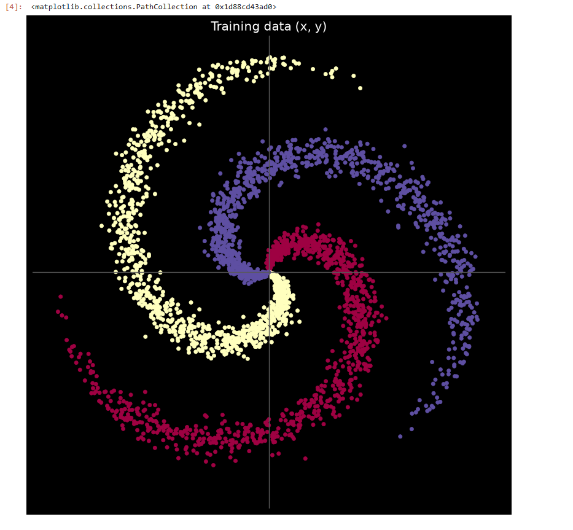

（1）线性模型分类：使用两层线性层（Linear(D, H) → Linear(H, C)），层间不加激活函数，用交叉熵损失和 SGD 优化器训练 1000 轮。

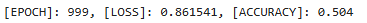

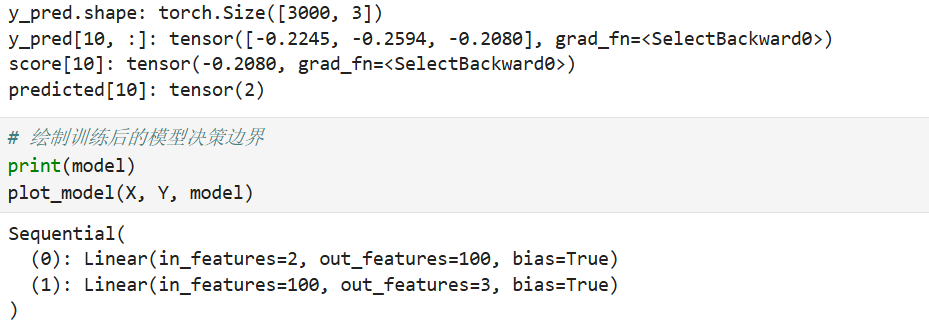

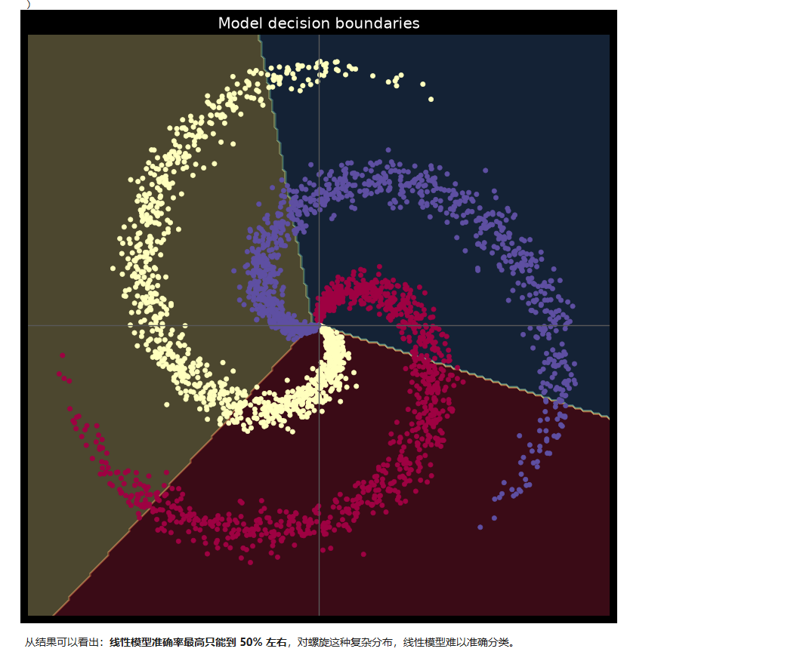

解读：y_pred 的形状为 [3000, 3]，每个样本对应 3 个类别的得分，取最大值所在位置即为预测类别。模型结构为两层线性层（2→100→3）。线性模型最终损失 0.861541、准确率仅 0.504（约 50%），从决策边界图可以看出，线性模型只能画出直线型边界，无法拟合螺旋形的复杂分布，因此难以准确分类。

（2）两层神经网络分类：与线性模型相比，在两层之间加入了 ReLU 激活函数，使用 Adam 优化器，其余训练设置相同。

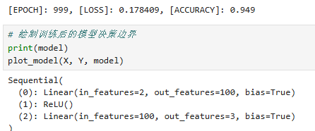

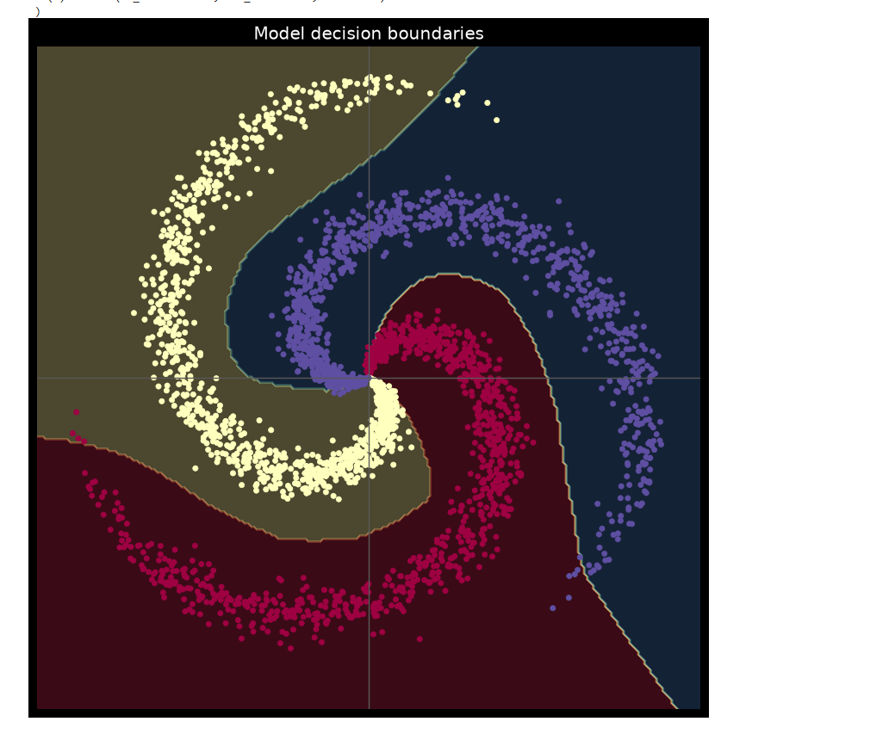

解读：加入 ReLU 后，模型结构变为 Linear(2,100) → ReLU → Linear(100,3)，最终损失降至 0.178409、准确率提升到 0.949。决策边界呈非线性的螺旋形状，能很好地贴合数据分布。这说明激活函数为网络引入了非线性表达能力，使神经网络能够拟合复杂的数据分布，分类能力显著提升。

### 第二部分：问题总结

1. AlexNet 有哪些特点？为什么可以比 LeNet 取得更好的性能？

AlexNet 的主要特点：网络更深（8 层，5 个卷积层 + 3 个全连接层），参数量更大；使用 ReLU 激活函数替代 sigmoid/tanh，训练更快且能缓解梯度饱和；使用 Dropout 防止过拟合；采用数据增强和重叠池化；利用 GPU 并行加速训练。

性能更好的原因：一是网络更深、容量更大，能学习更复杂的特征表示；二是 ReLU 解决了 sigmoid 在深层网络中梯度饱和的问题，使深层网络可以稳定训练；三是 ImageNet 大规模数据集和 GPU 算力使深层网络训练成为可能；四是 Dropout 等正则化手段有效降低了过拟合。

2. 激活函数有哪些作用？

激活函数的核心作用是给神经网络引入非线性。如果只有线性层堆叠，无论网络多深，整体仍是线性模型（本实验 3.2 中线性模型准确率只有约 50%），无法拟合复杂分布。加入激活函数后网络可以逼近任意非线性函数。此外，不同激活函数还有各自特性：ReLU 计算简单、正区间梯度恒为 1，能缓解梯度消失、加速收敛；sigmoid/tanh 输出有界，适合作为概率输出或需要饱和特性的场景，但存在饱和区梯度接近 0 的问题。

3. 梯度消失现象是什么？

梯度消失指在反向传播过程中，梯度从输出层向输入层逐层相乘传递，当各层导数小于 1（如 sigmoid 最大导数仅 0.25）或权重初始化过小时，浅层网络收到的梯度会指数级衰减趋近于 0，导致浅层参数几乎无法更新，深层网络难以有效训练。这是早期深度学习发展受阻的重要原因，推动了 ReLU 激活函数、逐层预训练（自编码器、受限玻尔兹曼机）以及残差连接等方法的发展。

4. 神经网络是更宽好还是更深好？

没有绝对的优劣，两者各有侧重。深度可以让网络逐层提取更抽象、更高层的特征，用相对更少的参数表达复杂函数，理论上更“高效”；但网络过深容易出现梯度消失、退化等问题，训练难度大，需要残差连接、归一化等技巧配合。宽度能增加网络容量、表达更多特征组合，但参数量剧增，容易过拟合且计算开销大。实践中通常适度加深并配合必要宽度，现代网络（如 ResNet）多采用“深而窄 + 残差连接”的结构。同时容量要与数据规模匹配，防止欠拟合或过拟合。

5. 为什么要使用 Softmax？

Softmax 把网络输出的原始得分（logits，可以是任意实数）转换为概率分布：每个类别的输出值落在 (0,1) 之间，且所有类别之和为 1，可以直观解释为“属于各类别的概率”，同时会放大得分之间的差异。分类任务中 Softmax 通常与交叉熵损失配合使用，二者组合的梯度形式简洁、数值稳定、训练效率高，因此成为多分类任务的标准做法（PyTorch 的 CrossEntropyLoss 内部即包含 softmax 处理，且采用 log-softmax 数值更稳定）。

6. SGD 和 Adam 哪个更有效？

在大多数情况下 Adam 更“省心”且收敛更快：它结合了动量（一阶矩估计）和自适应学习率（二阶矩估计），对学习率不敏感、能自动为不同参数调整更新步长，本实验中用 Adam 训练得到了 0.949 的准确率。SGD 是最基本的随机梯度下降，简单、对内存占用小，在充分调参（配合动量、学习率调度）时泛化性能往往更好，但对学习率等超参数敏感、收敛较慢。工程实践中通常先用 Adam 快速得到较好结果，需要追求极致泛化时再尝试精心调参的 SGD。

## 二、问题总结与体会

实验过程中遇到的问题及解决方式：

（1）国内无法直接访问 Google Colab，且本地原有的 Anaconda 版本过旧（Python 2.7，无法运行 PyTorch）。通过重新安装 Miniconda 并创建 Python 3.12 环境，配置国内镜像源（conda 与 pip 均使用清华镜像加速），成功安装 PyTorch（CPU 版）、Jupyter Notebook 和 matplotlib。

（2）实验指导中提到的绘图函数文件 plot_lib.py 以及原教程缺失的 ziegler.png 图片需要从 GitHub 下载，由于 GitHub 直连不稳定，通过镜像加速服务成功下载，并将两个文件与 notebook 放在同一目录供代码引用。

（3）本机没有 NVIDIA 显卡，使用 CPU 版 PyTorch 运行，device 显示为 cpu。训练两个模型各 1000 轮在本机约需一两分钟，速度可以接受，不影响实验完成。

收获与体会：

通过本次实验，我实际动手掌握了 PyTorch 的基本用法（Tensor 定义与运算、模型搭建、损失函数、优化器、前向/反向传播的完整流程），并通过螺旋数据分类实验直观体会到激活函数对神经网络表达能力的决定性作用：线性模型准确率仅约 50%，加入 ReLU 后提升到约 95%。同时加深了对深度学习中非线性、梯度消失等核心概念的理解，也锻炼了搭建和排查本地深度学习开发环境的能力。

对课程的建议：可以考虑为国内同学提供实验环境的国内镜像配置说明或预配置好的环境，减少因网络原因造成的环境搭建时间成本。